# Verilog RTL代码规范
## 第一章 总则
### 第1条 目的
1) 对Verilog RTL coding style进行规范。这些规范覆盖了代码的格式、端口和信号命名、一些设计技巧等等。由于篇幅的限制，一些常识性或者普遍性的规范（如Verilog本身语法要求的规范）并不会在本文中列出。
2) 针对项目中经常遇到的代码问题总结经验，给出规则和建议，以提升代码的质量（避免低层次bug）、提高可重用性和可维护性，并且有利于代码review。
3) 统一团队代码风格，让同事交流合作更顺畅、关系更融洽。

### 第2条 适用范围
1) IC逻辑设计工程师。

### 第3条 名词定义
1) RTL：Register Transfer Level(寄存器传输级)，是一种描述数字电路行为的抽象层次。

## 第二章 代码规范
### 第4条 代码规则级别
1) 为了区别不同规则的重要程度，定义两类分级（Level）：[规则]和[建议]。
a) [规则] (Rule，缩写R): 如果没有特殊情况，必须遵守的规范。如果不加以特别备注，本文内所有描述的缺省分级为[R]。
b) [建议] (Suggestion，缩写S): 不需要强制执行的规范，但是负责任的设计人员还是会遵守，本文每项规范分级为该等级的，在描述后加[S]表示。

### 第5条 代码格式规范
1) 文件头。
a) 所有Verilog代码都需要有文件头。
b) Verilog代码的文件头需要包括文件名，作者，其创建时间与概要描述等信息。每个模块的开头使用规范的文件头能够帮助后续开发人员了解该文件的作用，方便联系该文件的作者进行复用与维护。一个示例的文件头内容如下所示：
```verilog 文件头内容
//图 1 文件头内容
//--------------------------------------------------------------
// (C) COPYRIGHT 2020-2023 Sophgo Technologies Inc.
// ALL RIGHTS RESERVED
//
// Filename : <file_name>.v
// Author   : <author_name> (name@sophgo.com)
// Created  : <time>
// Description:
//   1) ...
//   2) ...
//
// History :
//   2022.02.08, <author1>, initial version
//   2022.04.07, <author2>, optimization for block ...
//--------------------------------------------------------------
```
c) Description部分可以概要描述模块的功能和设计思路、与外部连接的示意以及使用模块的注意事项等内容。History部分描述历史修改信息，列出修改的时间、作者和主要修改内容。
d) 文件头必须包含作者名。

### 第6条 命名规范
1) 文件和模块命名。
a) 一个.v文件包含最多一个module, 并且文件名与module name同名。[S]
b) module命名都采用小写，但 Vendor IP的module命名可以保留大写。[S]

2) 信号命名。
a) 要非常重视信号的命名，信号取完名字后，代码也就基本写完了。
b) 信号命名要直观、简洁、有含义。使用有具体含义的名称便于阅读。
c) 命名中不同含义可分段，每一小段之间使用下划线“_”来分隔。
d) 信号名称不宜过长，不超过30字符。[S]
e) 命名中只允许出现字母数字和下划线。
f) 命名必需字母开头。
g) 模块端口、信号的所有字母小写。[S]
h) 信号命名中不使用任何保留字。
i) 命名不能只通过大小写来区分。
j) 定义多bit总线使用降序[N-1:0]。
k) 信号命名建议采用缩写方式。[S]
常用的信号缩写见下表,表 1 信号缩写定义表：

| 全称              | 缩写        | 说明              |
|-------------------|-------------|-------------------|
| acknowledge       | ack         | 应答              |
| address           | addr        | 地址              |
| arbiter           | arb         | 仲裁              |
| check             | chk         | 校验，如CRC校验   |
| clock             | clk         | 时钟              |
| clear             | clr         | 清除              |
| configuration     | cfg         | 配置              |
| control           | ctrl        | 控制              |
| count             | cnt         | 计数              |
| current           | cur         | 当前的            |
| data in           | din         | 数据输入          |
| data out          | dout        | 数据输出          |
| write data        | wdat        | 写数据            |
| read data         | rdat        | 读数据            |
| decode            | dec         | 译码              |
| delay             | dly         | 延迟              |
| disable           | dis         | 不使能            |
| error             | err         | 错误（指示）      |
| enable            | en          | 使能              |
| frame             | frm         | 帧                |
| generate          | gen         | 生成，如CRC生成   |
| grant             | gnt         | 申请通过          |
| increase          | inc         | 加一              |
| interrupt         | intr        | 中断              |
| length            | len         | （帧、包）长      |
| memory            | mem         | 内存、存储        |
| output            | out(o)      | 输出              |
| priority          | pri         | 优先级            |
| pointer           | ptr         | 指针              |
| rd enable         | ren         | 读使能            |
| read              | rd          | 读（操作）        |
| read enable       | ren (rden)  | 读操作            |
| ready             | rdy         | 应答信号或准备好  |
| receive           | rx          | 接收              |
| register          | reg         | 寄存器            |
| request           | req         | 请求              |
| reset             | rst         | 复位              |
| segment           | seg         | 片段              |
| source            | src         | 源（端口）        |
| timer             | tmr         | 定时器            |
| temporary         | tmp         | 临时              |
| transmit          | tx          | 发送              |
| valid             | vld         | 有效信号          |
| write             | wr          | 写操作            |
| write enable      | wen (wren)  | 写使能            |
| left              | lft         | 左侧              |
| right             | rht         | 右侧              |
| top               | top         | 上方              |
| bottm             | bot         | 下方              |

l) start、end信号不用缩写。start和end一般是pulse信号，而不是电平信号。
m) 特定作用的信号添加后缀表明其作用。[S]
常用后缀命名方式见下表,表 2 常用信号后缀表。

| 全称        | 后缀   | 说明      |
|-------------|--------|-----------|
| active low  | _n    | 低有效    |
| clock       | _clk  | 时钟信号  |
| enable      | _en   | 开启使能  |
| disable     | _dis  | 关闭功能  |
| select      | _sel  | 选择      |
| chip enable | _ce   | 片选      |
| flag        | _flg  | 标志位    |
| delay       | _dly  | 延迟      |
| receive     | _rx   | 接收      |
| transmit    | _tx   | 发送      |

n) 打拍的寄存一般加_r后缀。为了说明某个寄存器xx的前一拍，可以用xx_d表示，这里_d表示寄存器的d端。

3) 宏和参数命名。
a) 宏定义所有字母大写, 如下示例：
```verilog
//图 2宏定义示例图
`define TSMC16LL
`define USE LIB CELL
`define CORE NUM 10
```
b) 有几个define是仿真常用的，只供仿真，综合不能打开：
```verilog
`define SIMULATION-- 仿真专用开关
`define EMULATOR-- 帕拉丁仿真专用
`define BEHAVIORAL-- 行为级模型
`define FAST_SIM-- 快速仿真模型
```
c) 宏允许带参数，参数可以小写，要求所有参数都要小括号括起来。如下示例：
```verilog
//图 3宏参数写法示意
`define IDX(x)((x)+1)*(32)-1):((x)(32)
`define BYTE_IDX(x)(((x)+1)*(8)-1):((x)*(8)))
```
d) 参数定义中所有字母大写。如下示例：
```verilog
//图 4 参数定义示意
parameter DAT WIDTH =32 ;
parameter ADR WIDTH =10;
```
e) 端口信号为结构体时，需要区分数据类型名称和端口名称：
```verilog
input/output  pkg_name::struct_name  io_name
```
在以上的显式定义中，io_name和struct_name要进行区分，否则即使回归可以正常pass，但在进行综合时会导致编译失败。

### 第7条 模块定义和例化
1) 模块的声明与书写采用统一的格式便于项目内部成员的理解与维护。建议采用port中定义input/output的方式。[S]
a) 模块声明示例如下，采用Verilog-2001语法，在port声明中定义input/output/inout，如果是寄存器输出output，也在port声明中定义。
```verilog
//图 5 模块声明接口示意
module module_example #(
    parameter DATW = 32,  // data width
    parameter ADRW = 20   // address width
) (
    input            clk,     // clock 500MHz
    input            rst_n,   // reset active low @ clk domain
    input [DATW-1:0] xx2yy_din,    // data in from ..
    input [ADRW-1:0] xx2yy_addr,   // @ address
    output reg [DATW-1:0] xx2yy_dout0,  // data out to yy
    output reg [DATW-1:0] xx2zz_dout1  // data out to zz
);

localparam LCDW = 32;  // Local data width
```
2) 将常量定义成参数 (parameter)，以提升可移植性。[S]
3) 可被上层传参修改的parameter，在module定义时声明。
4) 内部使用的参数在module port声明后，用localparam声明。[S]
5) 模块定义端口时可以按照端口方向 (如 input, output ) 分组定义或者按照功能和用途分组定义。[S]
6) 模块的端口列表上添加层次标记字符做前缀，如top_、pcie_。[S]
7) 例化名要与原模块名称一样加前缀u_表示例化，如果有多个，加前缀u0_、u1_等。[S]
8) 例化模块时，模块的端口信号的命名和连接信号的命名不变。[S]
9) 使用显示端口映射，禁止使用位置端口映射。如下示例采用显示端口映射：
```verilog
//图 6 模块例化端口映射示意
module_xx #(
    .DATW (64),  // data width
    .ADRW (20)   // address width
) u_module_xx (
    .clk     (clk),        // clock 500MHz
    .rst_n   (rst_n),      // reset active low @ clk domain
    .xx2yy_din  (xx2yy_din),   // data in from ..
    .xx2yy_addr (xx2yy_addr),  // address
    .xx2yy_dout (xx2yy_dout)   // data out to yy
);
```
10) 例化模块时不能缺少端口。
a) input端口必须连接，output端口如有不连的也需要例化时显示列出，括号内空着。如下示例，xx2yy_dout1和xx2yy_dout2是输出，尽管没有连接，也需要显示列出。
```verilog
//图 7 模块例化无连接接口示例
module_xx u_module_xx (
    .clk     (clk),        // clock 500MHz
    .rst_n   (rst_n),      // reset active low @ clk domain
    .xx2yy_din  (xx2yy_din),   // data in from ..
    .xx2yy_addr (xx2yy_addr),  // address
    .xx2yy_dout0 (xx2yy_dout), // data0 out to yy
    .xx2yy_dout1 (), // data1 out to yy
    .xx2yy_dout2 ()  // data2 out to yy
);
```
11) 不要在例化模块时进行逻辑操作。如下示例，例化时存在逻辑操作，不允许。
```verilog
//图 8 模块例化进行逻辑操作示意
module_example u_module_example (
    .clk     (clk),
    .rst_n   (rst_n),
    .eg_ctrl (eg_ctrl & eg_en),  // 注意：此处为组合逻辑表达式
    .eg_addr (eg_addr),
    .eg_dout (eg_dout)
);
```
12) 例化单独harden的模块或者IP时，不能传入parameter。
a) 单独harden的IP，外部例化传入parameter可能与内部parameter不一致导致出错。
13) 例化多模块复用的IP时，显式传入所有parameter。[S]
a) 当例化的IP在多个模块被使用时，即使想用parameter的默认值，也需要对该parameter默认值进行显式的例化，避免后续IP默认值修改导致出错。

### 第8条 注释规范
1) 为了增加代码的可读性，要及时进行注释。
2) Module定义中声明的parameter和port要加注释。[S]
3) 对于重要变量的声明，必须要有注释。
4) 对端口声明中的信号进行注释，最好在同一行，如果不在同一行，需在代码上方注释。[S]
5) 多行注释请使用 ```//``` 而非 ``` /*  */ ```。[S]
a) 先删除 ```/*``` 后会导致后续不需要注释的行也被标记为注释，可能会引起不必要的错误。
6) 例化的模块、状态机的状态，要有功能性的注释描述。[S]
7) 所有综合相关的指令必须在生效的地方进行记录，并且注释说明使用的原因、使用的工具。[S]
8) 编译器选项例如 ``` `ifdef```, ``` `else```  ``` `endif``` 必须有注释说明在哪里使用、并解释这个指令的用法。[S]

### 第9条 排版规范
1) 缩进使用 Space（空格）而非Tab（制表符）。
a) 不同的编辑器会将Tab解释为不同的宽度，导致缩进不统一，较长的语句通过缩进进行分层次将会增加代码的可读性，建议使用4个 Space 作为缩进。
2) 行的长度保持每行小于或等于 120 个字符。[S]
3) 信号的定义要对齐。[S]
4) 模块例化的信号要对齐。[S]
5) 每个.v文件代码行数控制在2000行以内为宜。[S]


## 第二章 电路设计规范
### 第1条 设计结构规范
1)  时序逻辑always块中的寄存器，采用非阻塞赋值"<="。
2)  组合逻辑always块中采用阻塞赋值"="。
3)  在同一always块语句中不允许同时出现阻塞赋值和非阻塞赋值。
4)  同一个寄存器不能在多个always块中被赋值。
5)  无关的信号不要在同一个always块里面赋值。**[S]**
    a)  如下面示例，tmp_r1与dat_r1没必要放在一个always块。
```verilog
//图 9 always块错误写法示例
always @(posedge clk or negedge rst_n) begin
    if (~rst_n) begin
        dat_r1 <= 32'd0;
        tmp_r1 <= 10'd0;
    end else if (cond3) begin
        if (cond1) begin
            dat_r1 <= logic1;
        end
        if (cond2) begin
            tmp_r1 <= logic2;
        end
    end
end
```
6)  在时序逻辑中不能对同一变量覆盖赋值。
    a)  如下面示例，if采用覆盖式赋值，应该用else if嵌套语句实现。
```verilog
//图 10 always块错误写法示意
always @(posedge clk or negedge rst_n) begin
    if (~rst) out <= 32'd0;
    if (sel0) out <= in0;
    if (sel1) out <= in1;
    if (sel2) out <= in2;
end
```
7)  组合逻辑always块敏感列表要列全。
    a)  可以用```always @(*)```方式避免遗漏**[S]**。
8)  避免出现组合逻辑反馈回路。
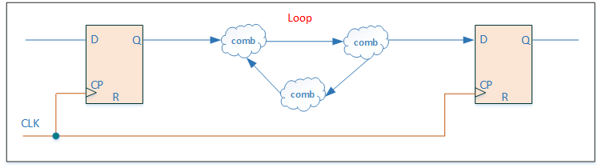
> 图 11 组合逻辑loop回路示例

a)  如果确实需要有意设计成组合逻辑loop，需要在SPEC中详细说明。例如有一个特例是process_monitor中存在回路，用于测试。确实需要loop时，代码实现时用SIMULATION的宏，里面加上延时，并仅用于仿真，防止仿真卡死。
9)  谨慎使用Latch。**[S]**
    a)  如确需要用到，须清楚地分析相关电路的时序以及毛刺带来的影响，并在SPEC中做详细说明。例如在top的IO逻辑中，会用到锁存器，防止TEST来后信号跳变。如下示例为产生latch的常规写法。
```verilog
//图 12 产生latch的常规写法
always @(test_enable or di_bi)
    if (!test_enable) begin
        bi_latch = di_bi;
    end
```

11)   避免出现输入为固定值的锁存器。

```verilog
//图 13 产生固定值锁存器写法示意
always @(cond) begin
    if (cond) test_d = 1'b1;
end
```
11)  组合逻辑always块中避免因if else或case语句不完整造成Latch。
    a)  如下面两种情况会产生Latch：
```verilog
//图 14 产生Latch写法一
always @(*) begin
    case (cond)
        2'b01 : test_d = 2'b11;
        2'b10 : test_d = 2'b10;
    endcase
end
```  
```verilog
//图 15 产生Latch写法二
always @(*) begin
    if (cond1) begin
        test_d = data_a;
    end else if (cond2) begin
        test_d = data_b;
    end
end
```
    b)  采用下面4种写法可避免产生Latch：
```verilog
//图 16 避免产生Latch写法一
always @(*) begin
    case (cond)
        2'b01 : test_d = 2'b11;
        2'b10 : test_d = 2'b10;
        default : test_d = 2'b00;
    endcase
end
```
```verilog
//图 17 避免产生Latch写法二
always @(*) begin
    test_d = 2'b00;
    case (cond)
        2'b01 : test_d = 2'b11;
        2'b10 : test_d = 2'b10;
    endcase
end
```
```verilog
//图 18 避免产生Latch写法三
always @(*) begin
    if (cond1) begin
        test_d = data_a;
    end else if (cond2) begin
        test_d = data_b;
    end else begin
        test_d = 8'd0;
    end
end
```
```verilog
//图 19 避免产生Latch写法四
always @(*) begin
    test_d = 8'd0;
    if (cond1) begin
        test_d = data_a;
    end else if (cond2) begin
        test_d = data_b;
    end
end
```
12)  时序逻辑的always块中尽量采用条件语句赋值。**[S]**
    a)  采用条件语句赋值后，便于工具插入clock gate。下面两个示例，左边示例没有用条件赋值，工具不会插入clock gate。右边示例有条件语句赋值，工具可以插入clock gate，以节省功耗。
```verilog
//图 20 工具不会插入clock gate写法示意
always @(posedge clk or negedge rst_n) begin
    if (~rst_n) begin
        dat_reg <= 32'd0;
    end else begin
        dat_reg <= din;
    end
end
```
```verilog
//图 21 工具会插入clock gate写法示意
always @(posedge clk or negedge rst_n) begin
    if (~rst_n) begin
        dat_reg <= 32'd0;
    end else if (din_vld) begin
        dat_reg <= din;
    end
end
```
13)  时序逻辑always块中，没必要在else中自己赋值给自己。**[S]**
    a)  下面红框自己给自己赋值可删去。
```verilog
//图 22 else 赋值冗余写法示意
always @(posedge clk or negedge rst_n) begin
    if (~rst_n) begin
        dat_r1 <= 32'd0;
    end else if (cond) begin
        dat_r1 <= data_a;
    end else begin          //红框
        dat_r1 <= dat_r1;   //红框
    end                     //红框
end
```

14)  在顶层集成子模块时，避免出现glue logic。
    a)  Block 单独harden后，如果顶层出现glue logic，不利于后端集成。
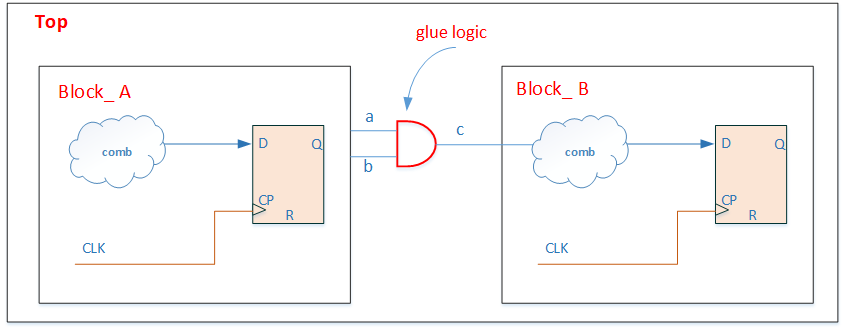
15)  例化模块的信号中不能包含表达式。
    a)  下面示例存在"&"逻辑，这种方式可导致Block之间产生glue logic，并且会对仿真debug造成干扰。
```verilog
//图 24 例化模块信号中包含表达式错误示例
module_example u_module_example (
    .clk     ( clk     ),
    .rst_n   ( rst_n   ),
    .eg_ctrl ( eg_ctrl & eg_en ),//红框
    .eg_addr ( eg_addr ),
    .eg_dout ( eg_dout )
);
```
16)  模块的输出尽量使用寄存输出。**[S]**

17) 例化harden的模块或IP时，不能传入parameter。
18) inout双向端口只允许在芯片顶层和IO模块中定义及使用。**[S]**
19) 芯片内部避免使用三态逻辑和三态buffer。**[S]**
    a)  特例：FPGA 的双向IO是可以用三态buffer的。
20) 在例化模块时不能出现将"Z"状态赋值到端口中。
    a)  下面示例是不建议的做法：
```verilog
//图 25 例化时含有"Z"的不规范写法示例
bufifo s2(dout1, 1'bz, en);
```
21)  在module中禁止使用task。
22)  在function中的变量需在function内部进行声明。
    a)  下面示例在module中编写了一个function，out变量是在function外声明的变量，就会在out=in处报错。
```verilog
//图 26 Function out错误赋值示例   
module test_f(in, out);

function val;
    input in;
    out = in;
endfunction

endmodule
```
23) function输出函数值的所有bit都要进行赋值。
    a)  下面示例函数值为16bit，计算赋值时只赋给了8个bit，违反规则。
```verilog
//图 27 Function输出函数值存在某些bit未赋值示例     
function [15:0] f_val;
    ......
    f_val[7:0] = inp;
endfunction
```
    
    图 27 Function输出函数值存在某些bit未赋值示例
24) function中的赋值语句需将值完全赋给函数值。
    a)  下面示例图28 function中没有else，条件不完全。图29有else才是合理的。
```verilog
//图 28 function条件语句不完全示例   
function func;
    input sel;
    if (sel)
        func = 1'b0;
endfunction
```
```verilog
//图 29 function条件语句正确写法示例
function func;
    input sel;
    if (sel)
        func = 1'b0;
    else
        func = 1'b1;
endfunction    
```
25) function中不能使用非阻塞赋值，并应避免出现assign赋值方式。
26) 在多bit运算中，避免使用逻辑运算符。
    a)  下面示例r为多比特，避免使用逻辑运算符" ! "，可以用 s = (r == 4'd0)或者s = ~(|r)代替。
```verilog
//图 30 多比特运算不建议写法示例
reg [3:0] r;
assign s = !r;
```

27) 避免使用表达式来索引数组的地址。
    a)  下面用idx+1表达式索引array方式要避免，可将idx+1独立赋值给idx_plus，用idx_plus去索引。
```verilog
//图 31 数组索引使用表达式错误写法示例
wire [4:0] array [7:0];
wire [2:0] idx;
wire [4:0] mux_d;

assign mux_d = array[idx + 1];
```

28) 避免出现无驱动输出的端口或信号。**[S]**
29) 在模块端口的定义后集中定义所有的内部信号。[S]
30) 模拟信号连接要避免插入buffer。
    a)  综合以及pd产生的netlist也要check，不能在模拟连线中插入buffer。
31) generate块需要显示命名。
    a)  如下面示例generate块显示给出命名，防止不同EDA工具产生的命名不一致，并且有利于仿真debug。如果存在多个generate块并且不对其进行命名，工具自动产生的命名会很相像干扰debug。
```verilog
// 图 32 generate块命名示例
genvar i;
generate
    for (i = 0; i < `CORE_NUM; i = i + 1) begin : CORE_GEN
        ...
    end
endgenerate
```
32) 单独插入scan的模块顶层输入信号需确保在scan模式下的值可控。以下示例说明。
    a)  图中Top_scan模块为需要独立插入scan的顶层模块，存在一个input信号din，一个output信号dout。为了提高测试覆盖率，需要确保在scan模式下（scan_mode=1），输入给内部的din为可控制的值。
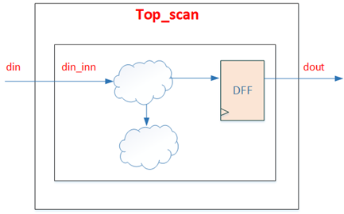
    b)  有下面两种实现种方式：下图其中一种，在scan模式下，让din输入给内部的din_inn置为0（或者1）。
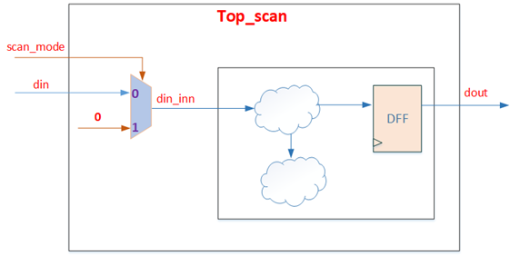
    c)  下图为另一种方式，scan模式下，让output 信号dout给到din_inn，这样可以方便scan测试dout，进一步提高测试覆盖率，所以该方式为最推荐的方式。
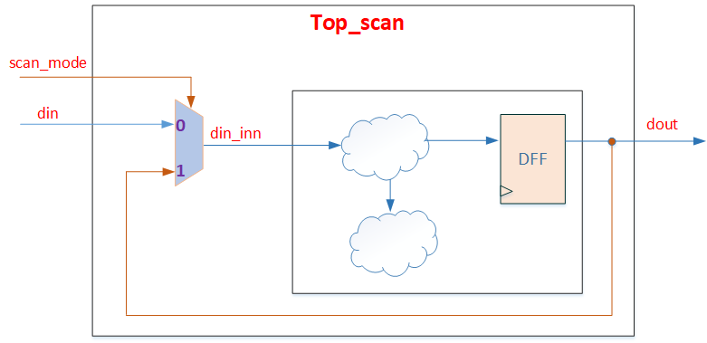
    图 35 scan模式下输入值为output信号回路
33) 编码逻辑清晰、代码简洁，避免啰嗦。**[S]**
    a)  always块中相同的赋值语句，对应的条件尽量合并起来。
    b)  下面两段逻辑功能一样，后边的显然更清晰明了，并有利于提高验证覆盖率。
```verilog
// 图 36 逻辑繁冗写法示例   
always @(posedge clk or negedge rst_n) begin
    if (~rst_n) begin
        ctrl <= 1'b0;
    end else if (cond1) begin
        if (cond2) begin
            ctrl <= 1'b1;
        end
    end else if (cond3) begin
        ctrl <= 1'b0;
    end
end
```
```verilog
// 图 37 逻辑清晰写法示例
always @(posedge clk or negedge rst_n)
    if (~rst_n)
        sig_r <= 1'b0;
    else if (sig)
        sig_r <= 1'b1;
    else
        sig_r <= 1'b0;
end
```
  c)  下面"打拍"逻辑两者写法，后面的写法更清晰。
```verilog
// 图 38 信号打拍的不规范写法示例
always @(posedge clk or negedge rst_n)
    if (~rst_n)
        sig_r <= 1'b0;
    else if (sig)
        sig_r <= 1'b1;
    else
        sig_r <= 1'b0;
end
```
```verilog
// 图 39 信号打拍的规范写法示例
always @(posedge clk or negedge rst_n)
    if (~rst_n)
        sig_r <= 1'b0;
    else
        sig_r <= sig;
end
```

###  第2条 时钟设计规范

1) 内部产生的时钟，需要在一个单独的模块中生成。
    a) 如果要放在不同的模块中，则要在Design SPEC中进行详细说明。

2) 每个模块的时钟信号应该从本模块的端口处得到。[S]  
    a) 下面clktmp时钟尽管是经过时序逻辑产生，但不是端口处获得，不推荐。这种产生时钟的逻辑需要在单独的时钟模块中处理。  
```verilog
// 图 40 clk不推荐写法示例
always@(posedge clk)
    clktmp <= en;

always@(posedge clktmp)
```
    b) 允许的特例为：内部用clock_gate产生新的时钟。

3) 禁止在内部模块中使用组合逻辑产生时钟。  
    a) 下面clk2时钟由组合逻辑产生，不合理。  
```verilog
// 图 41 clk由内部模块组合逻辑产生错误示例
input clk1;
reg a;
reg clk2;

clk2 = clk1 & a;
always @(posedge clk2 or negedge rst_n)
```
4) 在设计中使用时钟上升沿触发。[S]
a) 如果存在下降沿触发的情况，需要在Design SPEC中详细说明，并提出对综合及布线的要求。如果设计中同时存在上升沿和下降沿逻辑，要注意占空比，保证timing满足基本要求。混用上升沿下降沿特例：跨电源域的同步信号，输出采用下降沿，输入采样则用上升沿。
5) 时钟信号只能连接到寄存器的时钟端，禁止clk当做数据赋值。
a) 下面示例时钟clk连接到test寄存器数据端上，违反规则。
```verilog
// 图 42 clk当做数据赋值错误写法示
always@(posedge clk or negedge rst_n)
    if(!rst_n) test <= 1'b0;
    else       test <= clk;
```

6) 模块的时钟端，禁止将时钟管脚赋予固定值。
a) 下面把时钟端赋予固定值0，违反规则。
```verilog
// 图 43 时钟管脚为固定值示例
DFF u0 (
    .D  (Din  ),
    .CP (1'b0 ),
    .Q  (Dout )
);
```
7) 在每个always块中，只允许出现一个clock。
a) 下面示例出现两个clock，违反规则。
```verilog
// 图 44 always中出现两个clk示例
always @(posedge clkl or negedge clk2 or negedge rst_n)
```

8) 时钟通路上的cell必须为clock 专用cell。
a) 该项在综合和后端实现后的netlist需要进行 check。

9) Feedthrough的clock采用时钟反相器cell。
a) Feedthrough中的clock要用时钟cell，并且要用CKND，避免duty cycle问题。这一项在后端实现后也需要check。

10) 手动插入的clock gate cell需要在Design SPEC中说明，并提出综合及布线的要求。
a) 手动插入的clock gate会影响到后端 clock tree方案，需要一起讨论决定。

### 第3条 复位设计规范
1) 复位结构尽量简单，内部产生的复位信号，在一个单独的模块中生成。[S]

2) 避免在内部模块中使用组合逻辑生成复位信号。[S]
a) 这种方式产生的复位信号可能产生glitch，不能直接使用，而需要经过复位同步后使用。

3) 寄存器采用异步复位方式。

4) 寄存器复位信号应为低电平有效。[S]
a) 下面示例为高电平复位，不推荐。
```verilog
// 图 45 高电平复位示例
always @(posedge clk or posedge rst_n)
    if(rst_n)
        dat_r <= 1'b0;
```
5) 复位信号跨时钟域时，需要先做同步再使用。

6) 复位信号跨时钟同步时，确保scan模式下scan复位信号可以bypass到内部复位。
a) 如下图示例，scan的复位为输入rst_n，在scan模式下，内部复位new_rst_n需要bypass为rst_n，防止scan模式无法复位内部寄存器。
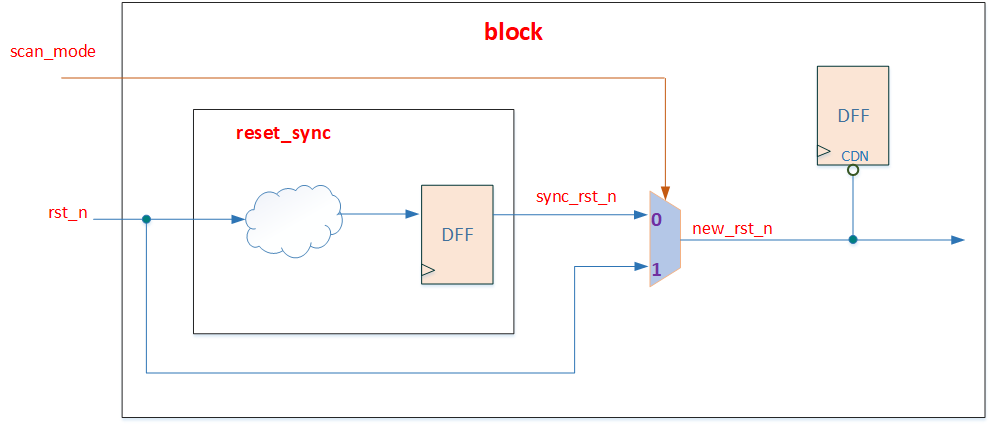

7) 在一个always块中复位信号不要超过1个。
a) 下面示例出现两个reset，违反规则。
```verilog
// 图 47 always块中出现两个reset示例
always @(posedge clk or negedge rst_n1 or negedge rst_n2)
```

8) 复位信号的触发必须与其极性相匹配，不能出现低有效的复位信号，在if条件中写成高触发等类似情况。
a) 下面示例把低有效的复位信号，写成高有效触发，极性不匹配，违反规则。
```verilog
// 图 48 复位触发与其极性不匹配示例
always @(posedge clk or negedge rst_n)
    if (rst_n)
```

9) 禁止出现同步复位和异步复位信号的组合逻辑。
a) 下面示例异步复位和同步复位信号进行组合逻辑违反规则。
```verilog
// 图 49 异步复与同步复位进行组合逻辑示例
always @(posedge clk or negedge async_rst) begin
    if( ~async_rst | sync_rst )
        ...
end
```

10) 组合逻辑不需要复位。
a) 下面示例组合逻辑用了复位，没有必要。
```verilog
// 图 50 组合逻辑存在复位示例
always @(*) begin
    if(~rst_n) begin
        test_d = 8'd0;
    end
    else if(cond1) begin
        test_d = dat1;
    end
    else begin
        test_d = 8'd0;
    end
end
```

11) 复位if逻辑后，后面用else，避免直接用if。
a) 下面示例应该用 else if才可以。
```verilog
// 图 51 复位if逻辑后再使用if示例
always @(posedge clk or negedge rst_n)
    if(~rst_n) begin
        test_d <= 1'b0;
    end
    if(clr) begin
        test_d <= 1'b0;
    end
    else if(vld) begin
        test_d <= datin;
    end
end
```
12) 复位值必须是常量。
a) 下面示例复位值为一个变量，违反规则。
```verilog
//图 52 寄存器复位值不是常量示例
always @(posedge clk or negedge rst_n)
    if(~rst_n) begin
        test_d <= data_init;
    end
    else if(clr) begin
        test_d <= 1'b0;
    end
    else if(vld) begin
        test_d <= datin;
    end
end
```

13) 多变量在一个时序always块时，复位要完整。
a) 下面示例中，dat3没有复位值，会导致rst_n信号会串入到dat3寄存器的D端或者clk端（通过clock gate的en串入），与预期设计不一致。
```verilog
// 图 53 多变量复位不完整示例
always @(posedge clk or negedge rst_n)
    if(~rst_n) begin
        dat1 <= 1'b0;
        dat2 <= 1'b0;
    end
    else if(cond) begin
        dat1 <= dat1_in;
        dat2 <= dat2_in;
        dat3 <= dat3_in;
    end
end
```

14) 用于控制的单bit信号，往往是需要复位的。而长位宽的数据信号，要根据使用场合决定是否需要复位。

### 第4条 表达式使用规范
1) 参与比较、加减等运算的操作数的位宽要匹配。
a) 下面示例A、B位宽不匹配进行了比较运算，违反规则。
```verilog
// 图 54 位宽不匹配变量进行逻辑运算错误写法示例
reg [1:0] A;
reg [2:0] B;

always @(*)
    if ( A < B )
        ...
```

2) 不允许用“?”当作常量匹配。
a) 下面示例A与?比较，不推荐。
```verilog
//图 55 用“ ？”作常量匹配错误写法示例
reg [3:0] A;

always @(*)
    if( A == 4'b1???);
        ...
```


3) 不允许多bit信号的边沿触发。
a) 下面示例clock为多bit时钟，不能直接用其边沿触发。
```verilog
//图 56 时钟为多比特信号错误写法示例
input[2:0]clock
always @ (posedge clock)
```


4) 例化模块或调用函数时，信号位宽要匹配。

5) 在同一操作中不能同时出现有符号数和无符号数。
a) 下面示例a为有符号数，b为无符号数，不能同时出现在同一操作中。
```verilog
//图 57 有符号数和无符号数进行逻辑运算错误示例
reg signed [31:0] a;
reg        [31:0] b;

assign c = a + b;
```

6) 在判断条件中不可以出现布尔表达式一直无效的情况。
a) 下面示例if条件始终不满足，这种无效电路应该移除。
```verilog
//图 58 if条件不存在满足情况示例
parameter P1 = 2;
parameter P2 = 1;

always @(*)
    if( P1 < P2 )
        ...
```

7) 逻辑比较操作符不能出现三态值X或Z 。
a) 下面示例if判断中出现了X，违反规则。
```verilog
//图 58 if条件不存在满足情况示例
if (in == 1'bx)
    ...
```
图 59 逻辑比较中出现“X”或“Z”示例

8) 信号只能有一个驱动（三态除外）。
a) 芯片内部只有模拟IP的信号可能用到三态多驱动，如模拟MUX的output。

9) 对于常数，需要指明位宽和进制（``` `d ``` ``` `h ``` ``` `b ``` ``` `o ```   )，如8’d0。[S]

10) 对于数据类型只能使用wire、reg、integer、genvar四种，且不可以为负数。

11) 在if条件语句中，不要使用算术运算表达式。[S]
a) 下面示例if中有a-1的算术运算，不推荐。
```verilog
//图 60 条件语句使用算术运算表达式示例
always @(*)
    if ( a - 1 == b )
        ...
```

12)  复杂表达式要使用括号将其分割为单个运算、逻辑或关系操作。
a) 下面示例采用后一种用括号括起来会更清晰。
不推荐写法：
```verilog
//图 61 复杂表达式不推荐写法示例
if (&a==1'b1&&!flag==1'b1||b==1'b1)
```

推荐写法：
```verilog
//图 62 复杂表达式推荐写法示例
if (((&a == 1'b1) && (!flag == 1'b1)) || (b == 1'b1))
```

13) 复杂条件表达式尽量简化。[S]
a) 如下面示例条件中8个表达式。
```verilog
//图 63 复杂条件不推荐写法示例
if( a || b || c || d || e || f || g || h )
```

b) 可合并成如下，这种方式有利于提高验证conditional coverage。
```verilog
//图 64 复杂表达式推荐写法示例
assign a_int1 = a || b || c || d;
assign a_int2 = e || f || g || h;
assign a_int3 = a_int1 || a_int2;

if( a_int3 )
```

14) 禁止一行存在多个赋值表达式。
```verilog
//图 65 一行存在多个赋值表达式示例。
assign a=b+1;assign c=d;assign dout=a&e;
```

15) 译码表达式的条件空间要尽量完备。[S]
a) 如下面示例，功能上nonce_id范围是``` 0~`CORE_NUM-1 ```，采用assign语句译码得到match0-match3， 条件并不完备，没有覆盖到nonce_id>=`CORE_NUM的情况，容错性能低，当nonce_id超出范围后无法覆盖。
```verilog
//图 66 译码表达式的条件不完备示例
assign match0 = (nonce_id>='CORE_NUM*4*0) && (nonce_id<'CORE_NUM*4*1);
assign match1 = (nonce_id>='CORE_NUM*4*1) && (nonce_id<'CORE_NUM*4*2);
assign match2 = (nonce_id>='CORE_NUM*4*2) && (nonce_id<'CORE_NUM*4*3);
assign match3 = (nonce_id>='CORE_NUM*4*3) && (nonce_id<'CORE_NUM*4*4);
```

16) 建议采用下面的方式实现，match3覆盖到nonce_id>=`CORE_NUM的情况，并且电路更简单，容错性能高。
```verilog
//图 67 译码表达式的条件完备示例
assign match0 =                              (nonce_id<'CORE_NUM/4*1);
assign match1 = (nonce_id>='CORE_NUM/4*1) && (nonce_id<'CORE_NUM/4*2);
assign match2 = (nonce_id>='CORE_NUM/4*2) && (nonce_id<'CORE_NUM/4*3);
assign match3 = (nonce_id>='CORE_NUM/4*3) ;
```

17) 尽量采用公共子表达式。[S]
a) 如下面示例抽取公共子表达式z=a+b。
```verilog
//图 68 抽取公共子表达式示例
assign x = a + b + c;
assign y = d + a + b;

assign z = a + b;
assign x = z + c;
assign y = d + z;
```

### 第5条 语句声明规范
1) 每一行不要定义多个变量。[S]
a) 下面示例一行定义多个变量：
```verilog
//图 69 一行定义多个变量示例
wire [N-1:0] signal1, signal2, signal3;
```

b) 改成如下每一行一个变量更为清晰。
```verilog
//图 70 定义变量正确写法示例
wire [N-1:0] signal1;
wire [N-1:0] signal2;
wire [N-1:0] signal3;
```

2) 信号需要显式定义。[S]
a) 没有显式定义的wire类型是当作1bit的，容易出错。

3) 信号声明时不要赋值。
```verilog
//图 71 信号声明存在赋值示例
reg temp = 1;
```

4) 禁止在组合逻辑中使用非阻塞赋值。

5) 禁止在时序逻辑中使用阻塞赋值。

6) 禁止对同一个变量既使用阻塞赋值，又使用非阻塞赋值。

7) 禁止同一个always块中既使用阻塞赋值，又使用非阻塞赋值。

8) 定义多bit总线使用降序。
```verilog
//图 72 定义多比特变量示例
reg [N-1:0] data;
```

9) 定义mem类型时位宽用降序，深度用升序。
```verilog
//图 73 定义mem类型变量示例
reg [N-1:0] mem_array [0:M-1];
```

a) 深度部分用升序[0:M-1]，便于验证环境初始化mem的数据，读取txt文件第一行对应mem_array[0]，更为清晰。

10)  避免局部变量名和全局变量名发生冲突。

11)  禁止在赋值语句中出现”X” / ”Z” 。

12) 谨慎使用for循环。[S]

13) 避免出现不确定的for循环的初始值。
a) 下面示例r初始值不确定，违反规则。
```verilog
//图 74 for循环初始值不确定示例
reg [7:0] r;

for (r[6:1] = 0; r <10; r=r+1)
for (r[0]   = 0; r <10; r=r+1)
```

14)  避免for循环中出现不明确的step语句。
a) 下面示例step不确定。
```verilog
//图 75 for循环step不确定示例
reg [7:0] r;

for (r = 0; r <10; r[2:0]=r+1)
```

15)  禁止在循环过程中对index值进行修改。
```verilog
//图 76 循环过程中对index进行修改示例
for(i=0;i<8;i=i+1)
    i=i+2;
```

16)   要求for循环中的条件的范围是可计算的（禁止for循环中条件范围出现变量）。
a) 下面示例a是变量，其值可能随时发生变化，用a作为循环的范围，会出现逻辑上的错误。
```verilog
//图 77 for循环条件范围出现变量示例
for(integer i = 0; i != a; i = i+1)
    ...
```

17)    要求for循环中条件的初始值是可以计算的。也就是禁止for循环中条件初始值中出现变量。

18) 禁止使用casex语句。

19) 建议不要使用casez语句。[S]

20) 建议使用case语句来代替没有优先级要求的嵌套if语句。[S]

21) case语句中的default分支放在最后一行。

22) 建议case语句的条件都是常量。
a) 下面示例case分支存在c+d表达式，不推荐。
```verilog
//图 78 case语句分支条件存在变量示例
always @(posedge clk)
    case(a)
        2'b00 : b <= 0;
        2'b01 : b <= 1;
        c+d   : b <= 0;
    endcase
```

23)  避免case的选择条件是常量; [S]
a) 下面示例case选择条件为常量1，生成的电路结构为3bit优先级的encoder。
```verilog
//图 79 case语句选择条件为常量示例
reg [2:0] encode;
reg [2:0] dout;

always @(*)
    case (1)
        encode[2] : dout = 3'b100;
        encode[1] : dout = 3'b010;
        encode[0] : dout = 3'b001;
        default   : dout = 3'b000;
    endcase
```

b) 上面语句逻辑功能同下：
```verilog
//图 80 case语句示例对比
always @(*)
    if(encode[2])
        dout = 3'b100;
    else if(encode[1])
        dout = 3'b010;
    else if(encode[0])
        dout = 3'b001;
    else
        dout = 3'b000;
```

24) case语句中的default可灵活合并一些分支以提高代码覆盖率。[S]
下面示例两种case描述，功能一样，后一种可以有更好的line coverage 和conditional coverage。
```verilog
//图 81 case default对比写法示例
always @(*) begin
    case(cond)
        3'b000 : dout = 1'b0;
        3'b001 : dout = 1'b0;
        3'b010 : dout = 1'b0;
        3'b011 : dout = 1'b1;
        3'b100 : dout = 1'b0;
        3'b101 : dout = 1'b1;
        3'b110 : dout = 1'b1;
        default : dout = 1'b1;
    endcase
end

always @(*) begin
    case(cond)
        3'b000 : dout = 1'b0;
        3'b001 : dout = 1'b0;
        3'b010 : dout = 1'b0;
        3'b100 : dout = 1'b0;
        default : dout = 1'b1;
    endcase
end
```

### 第6条 可综合设计规范
1) RTL设计中要避免使用不可综合的语句。
a) 如果RTL代码中要嵌入仿真语句用于debug，需要用`ifdef SIMULATION … `endif 段落嵌入，避免仿真语句被综合。综合的filelist中不可define SIMULATION，此define仅用于仿真。
b) 另外，仿真的语句也要注意条件，避免组合逻辑的条件直接触发，可能会有毛刺导致误判。如下示例用于监测conflict，用（a_hit & b_hit） 组合逻辑触发，可能导致虚假conflict被检测到。
```verilog
//图 82 避免仿真语句被综合示例一
`ifdef SIMULATION
    always @(*) begin
        if( a_hit & b_hit)
            $display ("Error! mem access conflict! ")
    end
`endif
```

c) 此时建议采用下面时序逻辑监测conflict，避免误判。
```verilog
图 83 避免仿真语句被综合示例二
`ifdef SIMULATION
    always @(posedge clk) begin
        if( a_hit & b_hit)
            $display ("Error! mem access conflict! ")
    end
`endif
```

2) 不允许使用initial 语句。
3) 不允许使用disable语句。
4) 不允许使用event语句。
5) 不允许使用wait语句。
6) 不允许使用repeat循环语句。
7) 不允许使用while循环语句。
8) 不允许使用forever循环语句。
9) 不允许使用fork join语句。
10) 不允许使用force语句。
11) 不允许使用release语句。
12) 不允许对同一个变量既使用阻塞赋值，又使用非阻塞赋值。
13) 不允许同一个always块中既使用阻塞赋值，又使用非阻塞赋值。
14) 不允许在多个always块中对同一个变量赋值。
15) always块中不允许出现assign/deassign语句。
16) 避免在代码中嵌入EDA工具的命令。[S]
a) 不要在源代码中使用嵌入式的EDA工具命令。因为其他的EDA工具并不一定能识别这些隐含的命令，这会导致错误的结果，降低代码的可移植性。当综合策略改变时，嵌在源代码中的命令不如 script 文件中的命令灵活。例如：
```verilog
//synopsys async_set_reset “reset”
```
b) 这个规则有一个例外就是编译开关的打开和关闭可以嵌入到代码中。例如：
```verilog
//synopsys translate_off
//synopsys translate_on
```
17) 信号必需显式定义。
a) 没有显式定义的wire类型是当作1bit的，容易出错。

18)  不允许使用``` "===" ``` 或者``` "!==" ```操作符。

19) function中不能包含时序逻辑。

20) 不允许使用“.”的方式调用其他层级信号。
a) 下面示例调用submodule下的data_in信号是违规的。
```verilog
//图 84 使用“.”调用其他层级信号示例
assign data_out = submodule.data_in;
```

21)  不建议使用delay延时语句。[S]
a) delay延时语句会被综合优化掉。
```verilog
//图 85 delay使用示例
assign #2 dout = din & sel;
always #2 dout = din;
always      dout = #2 din;
always @(posedge clk)
    dout <= #1 din;
```

22)  不允许使用除法（/）或者取模（%）的运算符直接对变量进行除法和取模运算。
a) 除法和取模运算需要专门进行设计，否则综合的电路效果很差。

23)  原则上用不到乘法器和除法器。逻辑设计中，乘法器和除法器资源开销大，往往可以用其他方式优化实现。

24) 不允许在敏感列表中出现同一个信号的双沿。
a) 下面示例一个always块既用clk的上升沿又用clk下降沿，违反规则。
```verilog
//图 86 always敏感列表中出现双沿示例
always @ (posedge clk or negedge clk)
```

1)  避免移位寄存器的移位值是变量。[S]
a) 下面示例“<<”左移一个变量，综合出的电路可能超出预期，不建议这种写法。
```verilog
//图 87 移位值是变量示例
input [7:0] data_in;
input [2:0] shift_a;
wire  [7:0] data_out;

assign data_out = (data_in << shift_a);
```
### 第7条 状态机设计规范
1) 状态机（FSM）采用**两段式写法**，即将状态机的描述分成两个always块，一个为组合逻辑得到nxt_state和状态机输出，一个为时序逻辑得到cur_state。

2) 要求状态机有默认状态。
a) 必须使用default条件为状态机指定一个默认的状态，防止状态机进入死锁状态。

3) 要求状态机的状态命名和编码要求：
a) 状态命名使用ST_前缀。
b) 在FSM输出逻辑较多时，状态编码建议使用独热码。独热码的编码方式可以让状态机输出逻辑的面积和时序更优。
c) 状态命名使用localparam，而不是parameter，是防止被外部例化时修改。
d) 状态名只会在两段式的always块中出现，理论上不会再出现于其他逻辑中。

4) 要求状态机的状态数不能过多，控制在40个以内。[S]
a) 状态数要合理，去除不必要的状态。

5) 状态机的代码示例。
```verilog
//图 88 状态机代码示例
localparam ST_IDLE   = 3'b001;
localparam ST_PROCESS = 3'b010;
localparam ST_END     = 3'b100;

reg [2:0] cur_state;
reg [2:0] nxt_state;
reg       process_en;

always @(posedge clk or negedge rst_n)
    if(~rst_n)
        cur_state <= 3'd0;
    else
        cur_state <= nxt_state;

always @(*) begin
    nxt_state = cur_state;
    process_en = 1'b0;
    case(cur_state)
        ST_IDLE: begin
            if(start)
                nxt_state = ST_PROCESS;
            else
                nxt_state = ST_IDLE;
        end
        ST_PROCESS: begin
            nxt_state = ST_END;
            process_en = 1'b1;
        end
        ST_END: begin
            nxt_state = ST_IDLE;
        end
        default: nxt_state = ST_IDLE;
    endcase
end
```

### 第8条 跨时钟域逻辑规范
1) 跨时钟域逻辑（异步逻辑）在处理上很容易出现隐患，因而在电路设计中要尤其重视。涉及异步处理的逻辑必须在SPEC中独立成章节（异步处理章节），进行详细说明，并要画出电路结构图和波形示意，方便review。

2) 对于设置multicycle约束的电路，也需要当作异步进行处理，在SPEC的异步处理章节中进行详细描述。

3) 下列描述跨时钟域的逻辑规范，实际项目中必须使用common ip来实现同步操作，禁止手动写代码实现（例如两级寄存器必须使用common_sync，不能通过写rtl打两拍）。
a) 单比特控制信号跨时钟域的时候，至少使用两级寄存器同步之后使用。
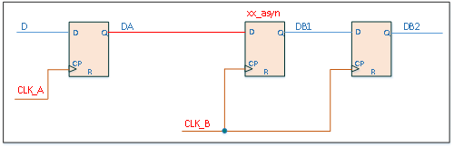
> 图 89 单bit信号跨时钟域同步

b) 跨时钟域第一级打拍的寄存器名称后缀为“_asyn”, 这样对编写约束和后仿真都比较方便。需要注意的是，这种跨时钟域电路目的是为了消除亚稳态影响，数据能否正确传输或采样，需要设计者根据实际情况来保证。

c) 多比特数据信号跨时钟域的时候，必须在数据稳定后进行采样。这里多比特数据信号，特指可能存在多比特同时变化的数据信号，在跨时钟域时，就必须在数据稳定后进行采样。如果可以保证多比特数据信号只有单个比特发生变化，例如counter经过格雷码变化后的信号，则可以直接采样。

d) 常用的多比特数据信号跨时钟域如下示例，是多比特数据信号dat_a（clka时钟域下）采样到另一个时钟域clkb下的常用处理方式，在tog_b_pulse有效时，dat_a必须是稳定有效的数据。数据带宽较高的多比特数据跨时钟域，可采用common的异步FIFO进行处理。
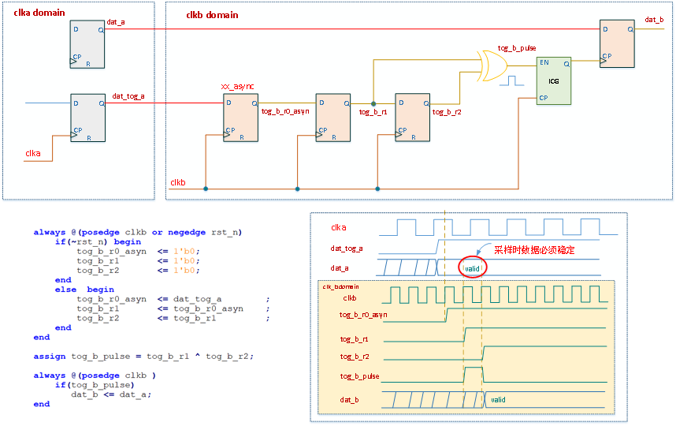
> 图 90 多bit信号跨时钟域同步
```verilog
// 图 90 多bit信号跨时钟域同步,代码部分
always @(posedge clk or negedge rst_n) begin
    if(~rst_n) begin
        tog_b_r0_asyn <= 1'b0;
        tog_b_r1      <= 1'b0;
        tog_b_r2      <= 1'b0;
    end else begin
        tog_b_r0_asyn <= dat_tog_a;
        tog_b_r1      <= tog_b_r0_asyn;
        tog_b_r2      <= tog_b_r1;
    end
end

assign tog_b_pulse = tog_b_r1 ^ tog_b_r2;

always @(posedge clk)
    dat_b <= dat_a;
```

e) 不允许组合逻辑输出的信号跨时钟域输出。不允许组合逻辑输出的信号跨时钟域，也就是跨时钟域的信号需要寄存器输出，避免出现glitch。示例如下，DB的毛刺可能被CLKB采到，在DB2出现不符合预期的脉冲。
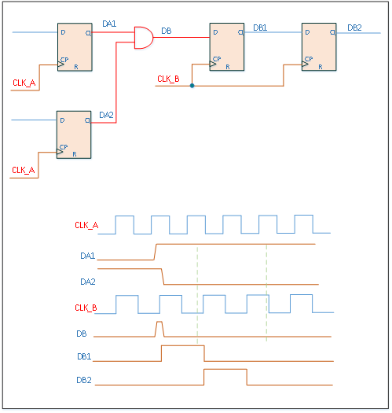
> 图 91 跨时钟域时使用组合逻辑引起毛刺的示例

f) 有时序对齐要求的操作需要在跨时钟域之前完成。上一条规则的案例DB出现了毛刺，是因为DA1和DA2有时序对齐的要求，改成如下电路，在跨时钟域前完成“DA1 & DA2”则不会出问题。
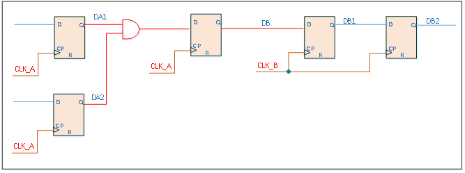
> 图 92 避免组合逻辑跨时钟域示例

另外，举例如下面电路，EN1和EN2都是从同一个信号D打拍过来，但在CLKB时钟域下，EN1和EN2就不再是对齐的。
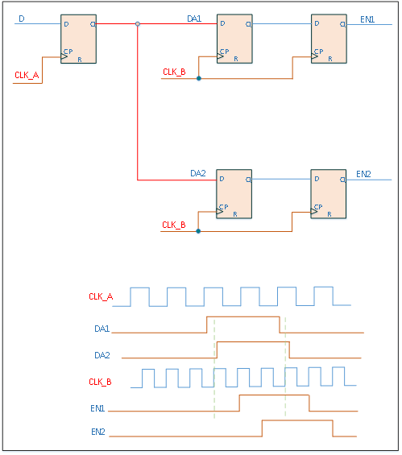
> 图 93 跨时钟域导致信号不对齐示例

g) 不能使用多个异步fifo来拼接成一个更宽的fifo。是上一条规则的延伸，经过异步fifo后，数据不再是对齐的，会导致拼接数据出错。

h) 复位异步FIFO时，需要在两个时钟域下都要进行复位。例如“写”时钟域复位后，“读”时钟域也要进行复位后再使用FIFO，否则异步FIFO内部读写指针将错乱，导致功能出错。常见错误：对其中一个时钟域进行软复位后，另一个时钟域没有复位导致出错。

4) 另外，总结几种跨时钟域常用实现方式：
a) 电平同步器。
适用于单比特位的控制信号或者进行格雷码编码的连续变化的数据信号。
文件路径：/ic/work/fe/common_ip/common_sync。

b) 复位信号同步器。
通常在对时序电路进行复位时建议使用异步复位，但是异步复位会带来亚稳态的问题，通过异步复位同步释放模块可以改善这个问题。
文件路径：/ic/work/fe/common_ip/common_reset_sync。

c) 脉冲同步。
从某个时钟域取出一个脉冲，然后在新的时钟域中建立另一个单时钟宽度的脉冲。
文件路径：/ic/work/fe/common_ip/common_pulse_sync。

d) 异步FIFO。
数据信号不存在依次变化的特性，格雷码对此类数据无效，因此采用异步FIFO、握手协议或者用使能信号控制这样的方式来进行数据的传输。
文件路径：/ic/work/fe/common_ip/common_async_fifo。

另外，core返回nonce建议采用专用异步FIFO—gn_fifo实现，其跨时钟域采用双向握手机制实现。
文件路径：/ic/work/fe/common_ip/gn_fifo。

e) 时钟切换。
时钟切换要防止出现毛刺。
文件路径：/ic/work/fe/common_ip/common_clkmux。

### 第9条 除法器例化规范
1) 除法器的parameter例化时外部都不传参，直接在内部写成实际使用值。
2) 除法器建议的输入输出都建议用reg打拍。如下图所示。
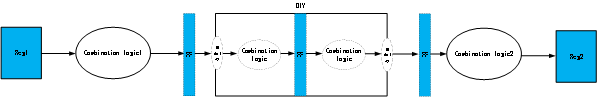
> 图 94 除法器例化示意图

### 第10条 SRAM使用规范
1) SRAM的模块命名要和功能应用解耦。
a) SRAM命名可以包含类型、深度、位宽等基本信息，而没必要包含SRAM的具体应用信息。例如深度为128、位宽为32bit的单口SRAM可以取名为 sram_sp_128x32。不同的功能可以使用相同的SRAM模块。

2) SRAM的读使能信号不能置为常值。
a) SRAM读使能如果一直有效，会浪费power，并且会导致输出data随address变化，给仿真验证带来干扰。

3) SRAM没有必要都放在顶层。SRAM的接口跟调用位置无关，遵循代码规范即可。

4) 尽量使用单口SRAM，原则上双口SRAM都可以用单口SRAM代替。

5) 不同Memory Compiler生成的SRAM，使能信号的极性可能不一样，需要谨慎。

### 第11条 模块划分建议
1) 不同时钟域的逻辑划分在不同的模块。
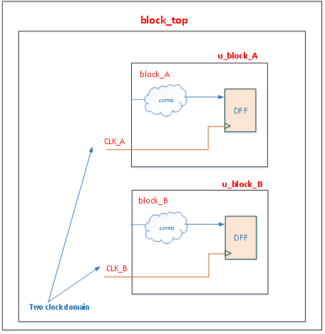
> 图 95 按时钟域划分模块示例

2) 如果两个异步时钟有数据交互，跨时钟域逻辑放在一个独立模块。[S]
这有利于单独处理跨时钟域电路，也使得代码review更加容易。

3) 时钟和复位generator分别在独立的模块实现。
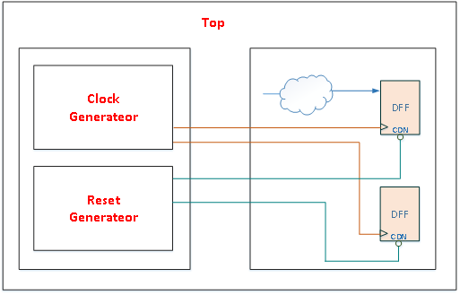
> 图 96 时钟与复位划分示例

4) 保持相关的组合逻辑在同一个模块中。这有利于综合工具对逻辑的优化，也有利于时序预算和快速仿真。

5) 对不同设计目标的电路分成不同的模块。[S]
a) 将含有关键路径的逻辑和非关键路径的逻辑分成不同的模块，以便综合工具对关键路径采用速度优化，对非关键路径采用面积优化。

6) IO PAD放在独立的模块。

7) 每个独立模块的输出信号，采用寄存器输出。[S]

8) 模块划分要兼顾模块逻辑大小。[S]
a) 单独harden的模块一般控制在100万个instance为佳， 这样EDA工具run time可控。

9) 顶层模块只负责连线，避免出现 glue logic。
a) 避免出现类似下图的glue logic。顶层模块集成时，相邻的harden block 之间只有IO一一相连，不能有其他任何cell，包括standard cell、TIE cell等。
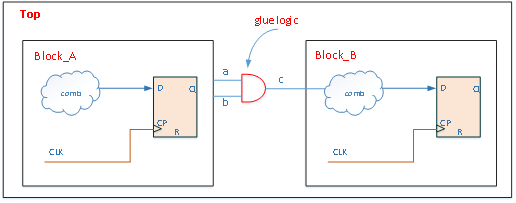
> 图 97 glue logic示例

b) 单独harden的模块，如有信号要输出到其他多个模块，需要将信号对应输出多路，每个模块单独对应一路。如下面示例，block_A、block_B、block_C都是单独harden的，block_A要输出cnn给block_B和block_C，如果只输出一个信号cnn，那么Top集成时，需要将cnn同时连接到block_B和block_C，后端很难处理。
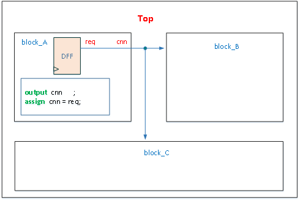
> 图 98 harden的模块之间不当的连线方式示例

c) 合理的做法是：block_A输出2个信号cnn_b和cnn_c，分别连接到block_B和block_C，如下图所示。
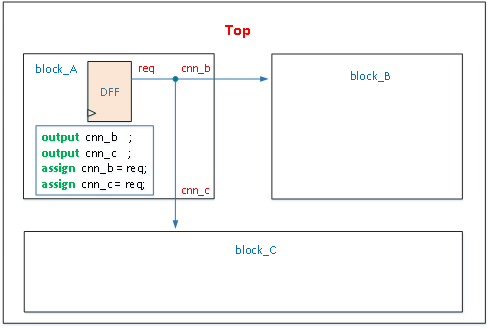
> 图 99 harden的模块之间推荐的连线方式示例